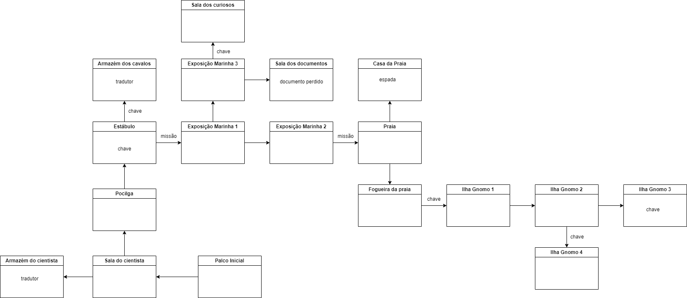

# Kujira Museum 

## Overview
Este projeto é um jogo desenvolvido na Godot Engine. A ideia foi recriar um jogo no estilo Retro Text Adventure, do início da década de 1980, mas com alguns elementos novos, como música, diversidade de comandos e fotos para NPCs. Para iniciar, me baseei na série de vídeos do canal [jmbiv](https://www.youtube.com/watch?v=wCI650TDhHA&list=PLpwc3ughKbZfkSPko3azFD4dd4IHSiQeE&ab_channel=jmbiv) , mas usei ele apenas para iniciar o projeto. Após isso, adicionei a história, a qual foi baseada no vídeo do [Pirula](https://youtu.be/kOywGhvNruU?si=T7NHoe4I9V6MdIIi) sobre origem das baleias. Apesar de ser simples, ela conta um pouco de história da biologia por meio de features divertidas. Espero que goste ! Para jogar, basta acessar a pasta [Playable](https://www.youtube.com/watch?v=wCI650TDhHA&list=PLpwc3ughKbZfkSPko3azFD4dd4IHSiQeE&ab_channel=jmbiv) e rodar o .exe.

## Project Structure
O repositório contém as seguintes pastas:

- **fonts/** - Contém todas as fontes usadas no jogo.
- **items/** - Armazena os diferentes itens disponíveis no jogo.
- **npcs/** - Contém os dados e configurações dos NPCs.
- **npc_pictures/** - Armazena sprites dos NPCs.
- **quests/** - Contém informações sobre as missões do jogo.
- **scenes/** - Inclui todas as cenas.
- **scripts/** - Contém os scripts da lógica do jogo.
- **sfx/** - Inclui efeitos sonoros utilizados no jogo.
- **visual/** - Contém elementos gráficos para exportar o jogo.
- **soundtrack/** - Armazena a trilha sonora do jogo.
- **voices/** - Contém arquivos de voz para os diálogos.

## Refactoring the Code
Depois de terminar o jogo, percebi que havia uma oportunidade para refatorar o código e facilitar na manutenção. Havia muitos partes hard coded, ou seja, com a variável inserida diretamente no código ao invés de ser acessível no editor. Ademais, para cada NPC estava adicionando um caso no **match**, o que estava fazendo o código ficar cada vez maior. Além de isso não estar de acordo com as boas práticas de programação, afeta também o trabalho de um Game ou Level Designer que trabalharia no jogo, visto que o mesmo teria que pedir ajuda ao desenvolvedor para cada personagem ou sala que desejasse adicionar. 

Por fim, organizei a estrutura baseada nos seguintes scripts:
- **Command Processor** - Seguindo o SRP do SOLID, essa classe deve ter apenas uma responsabilidade: processar os comandos. No jogo, o jogador pode inserir vários comandos (ir, falar, usar, etc). Essa classe vai analisar o comando, verificar em qual situação ele se encaixa e retornar um string com o comando de volta. A classe, porém, não tem o resultado os resultados dos comandos (o valor da string que irá retornar): isso é feito pelas outras classes que veremos abaixo, como NPC, Item, Quest, etc. Ademais, a classe também envia signals para comandos específicos, como por exemplo alterar a velocidade texto. Previamente, a construção do texto e outros comandos eram todos feitos nesta classe. Outro conceito do SOLID usado aqui foi o OCP, já que adicionar novos comandos é muito simples: basta adicionar o caso no **match** de **process_command** e escrever a respectiva função. Inventário, missões, saídas, descrever, velocidade e sonhar foram todas funções inéditas comparadas ao tutorial.
- **Exit** - Para realizar a conexão entre as diferentes **rooms**, criei um script para as saídas, as quais tem duas conexões, ambas direcionando para salas  diferentes. Ademais, a conexão com a sala pode estar bloqueada e isso pode ocorrer de forma bilateral ou não (trancar somente em uma direção, na outra estaria livre). Apesar de na build atula do jogo essa mecânica ser utilizada, ela já está implementada. As funções nesta classe são:
  - *get_other_room* - Como são duas conexões, é utilizado para checar qual a outra sala conectada
  - *lock_exit_of_room* - Bloqueia a saída de uma das conexões
  - *is_room_locked* - Confere se a saída está bloqueada
- **Quest** - Para organizar facilmente as missões do jogo, utilizei a mecânica de **Resource** da Godot, o que permitiu que eu deixasse as missões todas previamente criadas, com título e descrição, para posterior atribuição aos NPCs
- **Item** - Novamente utilizando **Resource**, porém neste caso há também o tipo do Item. Ele é importante para diferenciar se é um Tradutor (o qual desbloqueia novas falas), ou um Item de Quest. 
- **Room** - Essa classe também utiliza **Resource**, mas é um pouco mais complexa. A sala possui nome, descrição e um áudio específico que toca quando o jogador entra na sala. Ademais, usei a mecânica **@tool**, a qual permite que as mudanças feitas no editor afetem a parte visual da sala automaticamente sem necessidade de buildar o jogo. A classe também tem outros atributos:
  - **exits** - Neste caso foi necessário um dicionário: a chave é a direção (norte, sul, oeste e leste) e o valor é a saída (**Exit**)
  - **npcs** - Array que lista todos os Items (classe mencionada previamente) na sala
  - **items** - Array que lista todos os Items (classe mencionada previamente) na sala
Assim como mencionado, a manipulação de texto não é feita no **Command Processor**, mas sim aqui, por meio das funções:
  - *get_full_description*
  - *get_room_description*
  - *get_items_description*
  - *get_npcs_description*
  - *get_exits_description*
- **Room Manager** - Usada para determinar quais itens e quais NPCs vão em cada sala, ou até mesmo as conexões entre elas. Novamente garantindo SRP e OCP.
- **Types** - Neste caso utilizei a mecânica de **Autoload**, ou seja, ao iniciar o jogo essa classe é imediatamente colocada na cena. Ademais, posso acessá-la por outros script facilmente. Justamente por isso armazeno diversas informações universais nela, como:
  - **ItemTypes**
  - **SpeedTypes**
  - **SpeedValues**
  - **NPCTypes**
  - Diferentes códigos hexadecimais pré-definidos para cores no texto do jogo.
- **Sound Manager** - Também utilizo a mecânica de **Autoload**, mas agora para administrar SFX, Soundtrack e os sons que são utilizados nos momentos em que o diálogo é mostrado. Ao invés de cada classe referenciar o AudioPlayer na cena, somente o Sound Manager faz isso e as diferentes classes chamam *play_sfx*, *play_voice* ou *change_soundtrack*, o que garante o SRP.
- **Player** - Esta classe possui alta dependência do Command Processor, o que era de se esperar em um jogo como esse, o que não considero um problema. Caso um comando processado exija o inventário, é necessário chamar a função *get_inventory*, a qual já retornará todos os itens organizados. Portanto, apesar do acoplamento, as divisões estão bem definidas. 
- **Game** - No jogo, há uma caixa de Input para os comandos. Após o usuário enviar o comando, um signal é enviado para essa classe, o qual é tratado pela função *_on_input_text_submitted*. O texto enviado é processado pelo **Command Processor** e o resultado é enviado para o **Game Info**, que cria a resposta. Portanto, a class **Game** serve para orquestrar as diferentes partes do jogo
- **Game Info** - Serve como ponte entre o backend e a parte visual do jogo. É aqui que administra-se a quantidade de respostas no histórico, por meio da *_delete_history_beyond_limit*. Ademais, as respostas em si não ficam instanciadas no jogo logo que ele inicia, isso é tudo feito pela **Game Info**, nas funções *create_response* e *create_response_with_input*, sendo input o texto enviado pelo jogador. Ambas funções se conectam com o script **Input Response**
- **Input Response** - Responsável por determinar como o texto irá aparecer para o jogador.
  - *set_text*
  - *_animate_text* - Responsável por colocar na resposta caracter a caracter
  - *cancel_text_animation* - Para o processo do animate text e preenche toda a resposta imediatamente
  - *set_npc_picture*
  - *_process_all_text* - Já processa a resposta sem velocidade alguma

## Como Adicionar Novas Salas, Personagens, Quests e Itens

### Adicionando uma nova sala:
1. Acesse `scenes/game.tscn`.
2. Adicione um objeto de `scenes/room.tscn` sob o objeto RoomManager
3. Acesse o objeto e troque os seus parâmetros caso necessário 
4. Acesse o script RoomManager.gd e defina quais itens, NPCs e conexões há nessa sala

### Adicionando um novo personagem:
1. Crie um novo Resource na pasta `NPCs/` com as configurações básicas.
2. Adicione a sprite correspondente em `NPC_pictures/`.
3. Defina o comportamento e os diálogos no script:
- reward_item - ao falar com o npc, ele dá o item
- required_item - item necessário para disparar uma fala extra ou traduzir a fala 
- quest_item - item relacionado a quest
- reward_for_quest_item - reward dada ao receber o item da quest
4. Defina o tipo do NPC:
- DEFAULT - apenas revela a fala normalmente
- NEED_ITEM - precisa de um item para ter um diálogo extra, ou, caso o item necessário (required_item) seja do tipo TRANSLATOR, irá traduzir a fala
- GIVE_QUEST - ao falar com este NPC, ele dará uma quest específica (atributo quest_related)
- COMPLETE_QUEST - ao falar com este NPC, ele completa uma quest específica (atributo quest_related)
- RELATED_TO_QUEST - ao falar com este NPC, ele completa checa se você tem a missão (caso não tenha, ele irá adicionar) e também dá um item que irá te ajudar a completá-la
4. Atributos extras:
- picture - necessário ser do tamanho 30x30, formato png
- disappear_after_talk - caso true, o personagem irá desaparecer depois de mostrar seu diálogo
- can_unlock_path - NPC irá desbloquear novos caminhos para o jogador
- paths_to_unlock - dicionário que deve conter direção e sala que serão desbloqueados

### Adicionando um novo item:
1. Crie um novo Resource de item na pasta `Items/`.
2. Defina suas propriedades básicas
3. Acesse o script RoomManager.gd e coloque o item em uma sala específica ou atribua o item a um NPC

### Adicionando uma nova missão:
1. Crie um novo Resource de item na pasta `Quests/`.
2. Defina suas propriedades básicas
3. Atribua a missão a um NPC

## Overview do Mapa
O mapa do jogo é estruturado em diversas áreas interconectadas, cada uma com suas próprias características, NPCs e desafios. 
Para ajudar na criação das salas, usei o draw.io. Abaixo, o resultado:

## Links de recursos utilizados:

### Imagens:

https://kuramatoys.com/horseclaws-kai-kui-yupa-studio-ghibli-laputa-castle-in-the-sky/
https://g1.globo.com/mundo/noticia/2022/12/16/hipopotamo-tenta-engolir-crianca-em-uganda.ghtml
https://jornaldoempreendedor.com.br/destaques/inspiracao/desenvolvendo-sua-mente-forte-como-a-de-um-guerreiro-11-passos-simples/
https://www.em.com.br/internacional/2024/06/6872187-girafa-agarra-bebe-de-2-anos-durante-passeio-em-safari.html
https://aminoapps.com/c/senhor-dos-aneis-o-hobbit/page/item/frodo-bolseiro/K3n4_6WiKID5NZV3g0wZLB5JDJX7bjG3d
https://ortogonline.com/doc/pt_br/OrtogOnLineMag/6/Floresiensis.html
https://www.models-resource.com/nintendo_64/legendofzeldaocarinaoftime/model/589/
https://giventofly.github.io/pixelit/#tryit
https://rogerpayne.com/meet-roger/
https://www.atlasvirtual.com.br/anomalocaris.htm
https://blog.cobasi.com.br/baleia-orca-curiosidades-sobre-a-rainha-dos-mares/
https://pt.wikipedia.org/wiki/Ficheiro:Andrewsarchus_DB.jpg
https://www.autumnacresminipetpigs.com/pet-pigs-common-mistakes-avoid/
https://www.mudchute.org/farm-animals/pigs

### Áudio:
https://www.youtube.com/watch?v=ouSUF8hBcnM&ab_channel=Nullfuchs
https://www.youtube.com/watch?v=b_oEDGONSc4&ab_channel=LenaRaine
https://www.youtube.com/watch?v=tYqSewWpzyA&ab_channel=Shinx
https://www.youtube.com/watch?v=qfSJjC8a4GQ
https://www.youtube.com/watch?v=tkuSUN7UCis&ab_channel=analynlazarteblancaflorvlog
https://kenney.nl/assets/category:Audio?sort=update